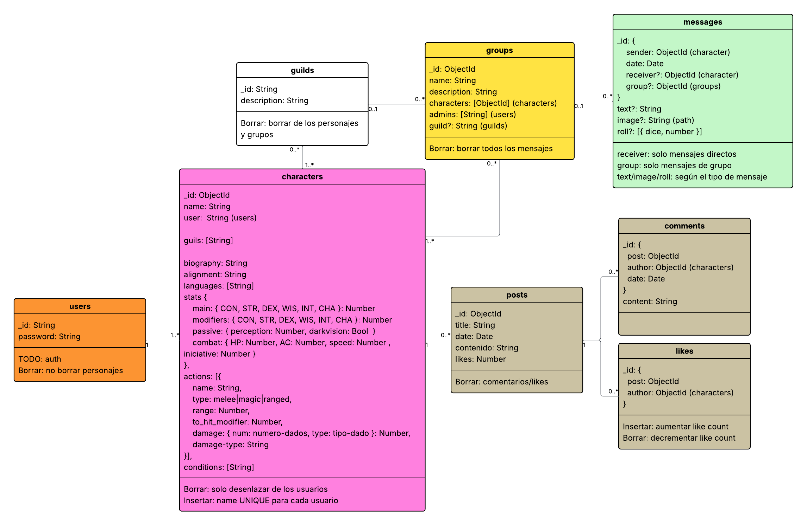

TavernNet es una red social temática inspirada en _Dungeons & Dragons_ (DnD).
En ella, los perfiles de los usuarios se representan como fichas de personaje,
con atributos, clases y estadísticas. La aplicación tendrá un sistema de _posts_
(publicaciones) y de _parties_ (grupos de chat).

> [!NOTE]
> No pretendemos implementar todas estas funcionalidades, solo aquellas partes
> que se correspondan mejor con lo se vea en la materia.

# Ejecutar

Primero se debe generar un certificado válido para firmar tokens de
autenticación JWT, que use curva elíptica:

```bash
# Generar clave privada ECC
openssl ecparam -name prime256v1 -genkey -noout -out jwt_ec.key.pem

# Generar certificado autofirmado (válido 10 años)
openssl req -new -x509 -key jwt_ec.key.pem -sha256 -days 3650 -subj "/CN=jwt" -out jwt_ec.crt.pem

# Empaquetar en un p12
openssl pkcs12 -export \
  -inkey jwt_ec.key.pem \
  -in jwt_ec.crt.pem \
  -name jwt \
  -out keys.p12 \
  -passout pass:XXXX \
  -keypbe AES-256-CBC \
  -certpbe AES-256-CBC \
  -macalg sha256 \
  -maciter \
  -iter 10000
```

Guarda el archivo `keys.p12` generado en `resources` con ese mismo nombre, y
luego configura las contraseñas como variables del entorno en un archivo `.env`.

Luego, para ejecutar una versión de desarrollo (con _live-reloading_) ejecuta el
script `./rundev.sh` y usa `./gradlew build` para recompilar.

Para la versión de producción, usa el `.jar` generado con el comando (configura
también las variables del entorno):

```bash
./gradlew bootJar
```

Los tests automatizados se ejecutan con el siguiente comando (requiere librería
de Python `requests`):

```bash
python test/main.py
```

# Características

- [ ] Perfiles de usuario con fichas de personaje
- [ ] Una misma cuenta puede tener varios personajes

Publicaciones:

- [ ] Texto e imágenes
- [ ] Comentarios y likes
- [ ] Generar _feed_ para el usuario

_Parties_:

- [ ] Grupos de mensajes entre personajes
- [ ] Administración por un usuario DM
- [ ] Mecánica para tirar dados con las _stats_ del personaje

# Diseño de la API

Usuarios y autenticación:

| Verbo    | URL                                           | Descripción                                    | Autenticacion |
|----------|-----------------------------------------------|------------------------------------------------|---------------|
| `GET`    | `/users?search=xxx&page=0&count=10`           | Buscar por nombre de usuario                   | No            |
| `POST`   | `/users`                                      | Crear nuevo usuario                            | *No*          |
| `GET`    | `/users/{userid}`                             | Consultar perfil de usuario                    | No            |
| `DELETE` | `/users/{userid}`                             | Borrar usuario                                 | Si            |
| `GET`    | `/users/{userid}/characters`                  | Obtener personajes del usuario                 | No            |
| `GET`    | `/users/{userid}/characters/{character-name}` | Consultar stats de personaje                   | No            |
| `POST`   | `/users/{userid}/characters`                  | Crear personaje                                | Si            |
| `PATCH`  | `/users/{userid}/characters/{character-name}` | Editar stats de personaje                      | Si            |
| `DELETE` | `/users/{userid}/characters/{character-name}` | Borrar el personaje                            | Si            |
| `POST`   | `/auth/login`                                 | Iniciar sesión como usuario                    | *No*          |
| `POST`   | `/auth/character-login`                       | Iniciar sesión como un personaje               | Si            |
| `POST`   | `/auth/refresh`                               | Genera un nuevo token sin contraseña           | Si            |
| `POST`   | `/auth/logout`                                | Cierra sesión (ADMIN puede sobre otro usuario) | Si            |
| `POST`   | `/users/{userid}/password`                    | Cambiar contraseña del usuario                 | Si            |

2 roles:

-   `ADMIN`: tiene todos los permisos, puede ejecutar todos los _endpoints_.
-   `USER`: se asigna por defecto a todos los usuarios creados. Solo tiene
    permisos sobre los recursos sobre los que es dueño.

Jerarquía: `ADMIN > USER`

Este `USER`, directamente solo podrá:

-   Crear, modificar y borrar personajes.
-   Cerrar sesión y refrescar sus tokens.
-   Cambiar su contraseña.
-   Cambiar de personaje
-   En caso de ser el DM de una _party_, podrá administrar el grupo y enviar
    mensajes.

El resto de operaciones presentadas a continuación (personajes, _posts_,
mensajes), se tendrán que realizar a través de un personaje. Entonces, el dueño
de estos recursos realmente no es el usuario en sí, sino el personaje:

-   **Usuario**: dueño de sí mismo y de sus personajes. Dueño de una _party_ si
    es DM. Si se borra, se eliminan en cascada sus personajes, y se dará un
    error si el usuario es DM de alguna _party_ (deberá transferirla a otro
    usuario o borrarla primero).
-   **Personaje**: dueño de sus posts, likes y comentarios. Puede mandar
    mensajes en una _party_ si es miembro. Si se borra, sus posts, likes,
    comentarios y mensajes se mantienen, pero debe marcarse como que su autor ha
    sido borrado. También se le eliminará de las parties en las que es miembro.

Contenido del JWT:

- `sub` (`.subject()`): sujeto principal
- `exp` (`.expiration()`): fecha de caducidad
- `nbf` (`.notBefore()`): no se puede usar antes de esta fecha
- `iat` (`.issuedAt()`): fecha de emisión
- `role`: `USER` o `ADMIN`
- `act_ch`: identificador del personaje activo. Puede ser `null`

El _RefreshToken_ será un UUID que se enviará en una cookie segura llamada
`__Secure-RefreshToken` solo para la _path_ `/auth/refresh`, y se rotará en cada
_refresh_. Nótese también que al borrar un usuario o cambiar la contraseña
invalida sus _RefreshTokens_.

Luego, para ser 100% RESTful, los _endpoints_ de inicio de sesión no deberían
ser los que se han seleccionado:

-   `/auth/login` debería ser `POST /auth/user-sessions`
-   `/auth/refresh` debería ser `POST /auth/user-sessions` y que de alguna forma
    invalide el anterior.
-   `/auth/logout` debería ser `DELETE /auth/user-sessions/{session-id}`

Pero, hemos decidido no hacerlo por los siguientes motivos:

-   Las sesiones JWT con son recursos como tal.
-   Puede ser confuso, ya que es menos intuitivo y el resto de APIs no lo hacen
    de esta forma.
-   No aporta ningún beneficio adicional, de hecho, solo complica la
    implementación por tener que añadir identificadores a las sesiones.

Otras decisiones de diseño:

-   Se usa `POST` en lugar de `PUT` para el cambio de contraseña porque no es
    idempotente, es decir, no se puede repetir la petición de forma segura: si
    la primera cambia la contraseña, la siguiente petición usará una contraseña
    desactualizada.
-   El cambio de contraseña, aunque es una operación sobre `/users`, se
    implementa en `AuthService` porque se trata de una operación de seguridad y
    necesita acceso al repositorio de los _RefreshTokens_.

Creación de posts:

| Verbo    | URL                                        | Descripción                  | Autenticacion |
|----------|--------------------------------------------|------------------------------|---------------|
| `GET`    | `/posts?page=0&count=10`                   | Lista de últimos posts       | No            |
| `POST`   | `/posts`                                   | Crear un post                | Si            |
| `GET`    | `/posts/{postid}`                          | Consultar un post            | No            |
| `DELETE` | `/posts/{postid}`                          | Borrar un post               | Si            |
| `POST`   | `/posts/{postid}/like`                     | Dar un like a un post        | Si            |
| `DELETE` | `/posts/{postid}/like`                     | Quitar un like a un post     | Si            |
| `GET`    | `/posts/{postid}/comments?page=0&count=10` | Obtener lista de comentarios | No            |
| `POST`   | `/posts/{postid}/comments`                 | Enviar comentario a un post  | Si            |

Mensajes:

| Verbo    | URL                                         | Descripción                            | Autenticacion     |
|----------|---------------------------------------------|----------------------------------------|-------------------|
| `GET`    | `/parties?search=xxx&page=0&count=10`       | Buscar _parties_ existentes            | No                |
| `POST`   | `/parties`                                  | Crear una nueva _party_                | Si                |
| `GET`    | `/parties/{party-id}`                       | Obtener miembros de la _party_ y DM    | No                |
| `POST`   | `/parties/{party-id}`                       | Añadir/quitar miembros de la _party_   | Si (DM)           |
| `PATCH`  | `/parties/{party-id}`                       | Administrar _party_                    | Si (DM)           |
| `DELETE` | `/parties/{party-id}`                       | Borrar _party_                         | Si (DM)           |
| `DELETE` | `/parties/{party-id}?member={character-id}` | Borrar miembro de la _party_           | Si (DM)           |
| `GET`    | `/parties/{party-id}/messages`              | Obtener ultimos mensajes de la _party_ | *Si* (Miembro/DM) |
| `POST`   | `/parties/{party-id}/messages`              | Enviar mensajes                        | Si (Miembro/DM)   |

NOTA: La notificación de nuevos mensajes requiere _pulling_. Una mejor
estrategia sería usar _WebSockets_, pero eso está fuera del alcance.

# Diseño del modelo de datos

Se puede consultar el modelo actualizado en el archivo [model.mdj](./model.mdj)
usando StarUML. La siguiente captura de pantalla puede que esté desactualizada.



# Características de implementación

-   `DatabaseInicializer` crea unas entradas en la BD si no existen, incluyendo
    los índices necesarios. Esto hace que se marquen con el nombre de la clase
    apropiada, en lugar de crearlos manualmente.
-   Se ha hecho una anotación que permite validar `ObjectId`s.
-   Interfaz `Ownable` para determinar quién es el dueño de un recurso.
-   `ErrorController` que maneja gran parte de los errores por peticiones
    inválidas.
-   Todos los servicios dejan registrado lo que van haciendo en _logs_.
-   Scripts que prueban la API completa.


# Estilo del código

Normas generales:

- Código en inglés pero los comentarios en español, escritos apropiadamente con
  sus tildes y `ñ`s.

- Se usarán 4 espacios de indentación y codificación UTF-8 con terminaciones LF.
  Esto se puede comprobar con los siguientes comandos:
  ```bash
  fd -tf -H -E .git -x file
  rg '\t'
  ```

- `PascalCase` para nombres de clases, `camelCase` para métodos y variables,
  `UPPER_SNAKE_CASE` para constantes, `alllowercase` para los paquetes; según
  dicta la convención en Java.

- Restringir la longitud de las líneas a 80 caracteres. Si se supera, la línea
  se separará en varias indentadas, cada una iniciando por un operador o después
  de una coma. Se permiten excepciones puntuales (_imports_, _strings_ o código
  alineado).

- Se usarán comentarios separadores para organizar el código en secciones
  temáticas.

Estilo general y espaciado:

- Las llaves de bucles y condicionales irán en la misma línea, según dicta la
  convención en Java.
- Espacios entre cada operador, palabra reservada y antes de cada llave (excepto
  puntos, comas y paréntesis).
- Evitar muchos niveles de anidamiento, usar _early return_ cuando sea posible.
- Evitar bucles y condicionales sin llaves de una única línea, usar al menos 2.
- Evitar espacios innecesarios: al final de línea, líneas con solo espacios,
  espacios duplicados, etc; incluyendo líneas en blanco.

