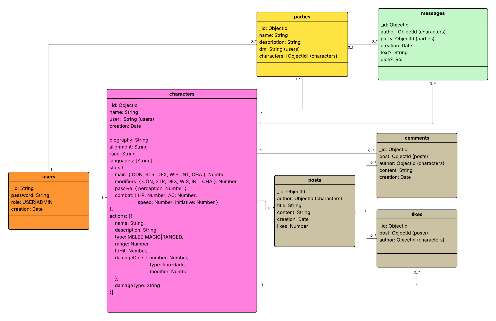

TavernNet es una red social temática inspirada en _Dungeons & Dragons_ (DnD).
En ella, los perfiles de los usuarios se representan como fichas de personaje,
con atributos, clases y estadísticas. La aplicación tendrá un sistema de _posts_
(publicaciones) y de _parties_ (grupos de chat).

# Ejecutar

Para una versión de producción:

```bash
docker compose build
docker compose up -d

# Si se quiere ver el estado:
docker logs tavernnet-server-1

# Terminar la ejecución (los datos se conservan):
docker compose down
```

Esta versión requiere generar las claves y certificados para la firma y
verificación de los JWT en un directorio `certs`. Se deberán configurar las
variables de entorno apropiadamente con las contraseñas de estos archivos.

Para la versión de desarrollo, con _live-reloading_ sobre el código:

```bash
docker compose -f compose.dev.yaml build
docker compose -f compose.dev.yaml up -d
# Para ver los logs
docker attach tavernnet-server-1
# Y para terminar la ejecución:
docker compose down
```

Si no existen las claves y certificados, se generarán automáticamente a la hora
de crear la imagen.

Los tests automatizados se ejecutan con el siguiente comando (requiere librería
de Python `requests`), o cambiando de módulo para solo ejecutar un subconjunto
de los tests:

```bash
python -m test.all
python -m test.login
python -m test.posts
python -m test.parties
python -m test.users_characters
```

Esto también está integrado dentro del contenedor de desarrollo:

```bash
docker exec -ti tavernnet-server-1 sh
# Y dentro del contenedor:
python test/main.py
# curl también está disponible para algunas pruebas
# Para navegar los archivos:
hx .
# Para recompilar
./gradlew build
```

# Introducción

<!-- TODO: explicar lo que es D&D, poner una captura de una ficha de personaje -->

# Diseño del modelo de datos

<!-- TODO: actualizar el diagrama -->



<!-- TODO: explicar criterios de borrado -->

# Arquitectura

<!-- TODO: diagrama de la arquitectura -->
<!-- TODO: mostrar los 2 dockerfiles -->

# Diseño de la API

## Usuarios y personajes (`UserService`, `CharacterService`)

| Verbo    | URL                                           | Descripción                                    | Autenticación |
|----------|-----------------------------------------------|------------------------------------------------|---------------|
| `GET`    | `/users search=X author=X page=0 count=1`     | Buscar por nombre de usuario (paginado)        | No            |
| `POST`   | `/users`                                      | Crear nuevo usuario                            | **NO**        |
| `GET`    | `/users/{userid}`                             | Consultar perfil de usuario                    | No            |
| `DELETE` | `/users/{userid}`                             | Borrar usuario                                 | Si            |
| `GET`    | `/users/{userid}/characters`                  | Obtener personajes del usuario                 | No            |
| `GET`    | `/users/{userid}/characters/{character-name}` | Consultar stats de personaje                   | No            |
| `POST`   | `/users/{userid}/characters`                  | Crear personaje                                | Si            |
| `PATCH`  | `/users/{userid}/characters/{character-name}` | Editar stats de personaje                      | Si            |
| `DELETE` | `/users/{userid}/characters/{character-name}` | Borrar el personaje                            | Si            |

<!-- TODO: imágenes de foto de perfil: usuario y personajes -->

<!-- TODO: poner ejemplo del JSON -->
<!-- TODO: poner ejemplo del JSON -->

## Operaciones de autenticación y seguridad (`AuthService`)

| Verbo    | URL                        | Descripción                                    | Autenticación |
|----------|----------------------------|------------------------------------------------|---------------|
| `POST`   | `/auth/login`              | Iniciar sesión como usuario                    | **NO**        |
| `POST`   | `/auth/character-login`    | Iniciar sesión como un personaje               | Si            |
| `POST`   | `/auth/refresh`            | Genera un nuevo token sin contraseña           | Si            |
| `POST`   | `/auth/logout`             | Cierra sesión (ADMIN puede sobre otro usuario) | Si            |
| `POST`   | `/users/{userid}/password` | Cambiar contraseña del usuario                 | Si            |

<!-- TODO: convertir USER a ADMIN -->

<!-- TODO: poner ejemplo de las respuestas -->

2 roles:

-   `ADMIN`: tiene todos los permisos, puede ejecutar todos los _endpoints_.
-   `USER`: se asigna por defecto a todos los usuarios creados. Solo tiene
    permisos sobre los recursos sobre los que es dueño.

Jerarquía: `ADMIN > USER`

Este `USER`, directamente solo podrá:

-   Crear, modificar y borrar personajes.
-   Cerrar sesión y refrescar sus tokens.
-   Cambiar su contraseña.
-   Cambiar de personaje
-   En caso de ser el DM de una _party_, podrá administrar el grupo y enviar
    mensajes.

El resto de operaciones presentadas a continuación (personajes, _posts_,
mensajes), se tendrán que realizar a través de un personaje. Entonces, el dueño
de estos recursos realmente no es el usuario en sí, sino el personaje:

-   **Usuario**: dueño de sí mismo y de sus personajes. Dueño de una _party_ si
    es DM. Si se borra, se eliminan en cascada sus personajes, y se dará un
    error si el usuario es DM de alguna _party_ (deberá transferirla a otro
    usuario o borrarla primero).
-   **Personaje**: dueño de sus posts, likes y comentarios. Puede mandar
    mensajes en una _party_ si es miembro. Si se borra, sus posts, likes,
    comentarios y mensajes se mantienen, pero debe marcarse como que su autor ha
    sido borrado. También se le eliminará de las parties en las que es miembro.

Contenido del JWT:

- `sub` (`.subject()`): sujeto principal
- `exp` (`.expiration()`): fecha de caducidad
- `nbf` (`.notBefore()`): no se puede usar antes de esta fecha
- `iat` (`.issuedAt()`): fecha de emisión
- `role`: `USER` o `ADMIN`
- `act_ch`: identificador del personaje activo. Puede ser `null`

El _RefreshToken_ será un UUID que se enviará en una cookie segura llamada
`__Secure-RefreshToken` solo para la _path_ `/auth/refresh`, y se rotará en cada
_refresh_. Nótese también que al borrar un usuario o cambiar la contraseña
invalida sus _RefreshTokens_.

Luego, para ser 100% RESTful, los _endpoints_ de inicio de sesión no deberían
ser los que se han seleccionado:

-   `/auth/login` debería ser `POST /auth/user-sessions`
-   `/auth/refresh` debería ser `POST /auth/user-sessions` y que de alguna forma
    invalide el anterior.
-   `/auth/logout` debería ser `DELETE /auth/user-sessions/{session-id}`

Pero, hemos decidido no hacerlo por los siguientes motivos:

-   Las sesiones JWT no son recursos como tal.
-   Puede ser confuso, ya que es menos intuitivo y el resto de APIs no lo hacen
    de esta forma.
-   No aporta ningún beneficio adicional, de hecho, solo complica la
    implementación por tener que añadir identificadores a las sesiones.

Otras decisiones de diseño:

-   Se usa `POST` en lugar de `PUT` para el cambio de contraseña porque no es
    idempotente, es decir, no se puede repetir la petición de forma segura: si
    la primera cambia la contraseña, la siguiente petición usará una contraseña
    desactualizada.
-   El cambio de contraseña, aunque es una operación sobre `/users`, se
    implementa en `AuthService` porque se trata de una operación de seguridad y
    necesita acceso al repositorio de los _RefreshTokens_.

## Creación de posts (`PostService`)

| Verbo    | URL                                        | Descripción                  | Autenticación |
|----------|--------------------------------------------|------------------------------|---------------|
| `GET`    | `/posts search=X author=X page=0 count=10` | Buscar posts (paginado)      | No            |
| `POST`   | `/posts`                                   | Crear un post                | Si            |
| `GET`    | `/posts/{postid}`                          | Consultar un post            | No            |
| `DELETE` | `/posts/{postid}`                          | Borrar un post               | Si            |
| `POST`   | `/posts/{postid}/like`                     | Dar un like a un post        | Si            |
| `DELETE` | `/posts/{postid}/like`                     | Quitar un like a un post     | Si            |
| `GET`    | `/posts/{postid}/comments page=0 count=10` | Obtener lista de comentarios | No            |
| `POST`   | `/posts/{postid}/comments`                 | Enviar comentario a un post  | Si            |

<!-- TODO: editar post, borrar comentario, editar comentario -->

<!-- TODO: ejemplos -->
<!-- TODO: imágenes en los posts/comentarios -->

## _Parties_ y mensajes (`PartyService`)

| Verbo    | URL                                                      | Descripción                            | Autenticación       |
|----------|----------------------------------------------------------|----------------------------------------|---------------------|
| `GET`    | `/parties search=XXX page=0 count=10`                    | Buscar _parties_ existentes (paginado) | No                  |
| `POST`   | `/parties`                                               | Crear una nueva _party_                | Si                  |
| `GET`    | `/parties/{party-id}`                                    | Obtener miembros de la _party_ y DM    | No                  |
| `DELETE` | `/parties/{party-id}`                                    | Borrar _party_                         | Si (DM)             |
| `PUT`    | `/parties/{party-id}/dm`                                 | Cambiar DM de la _party_               | Si (DM)             |
| `POST`   | `/parties/{party-id}/members`                            | Añadir miembros a la _party_           | Si (DM)             |
| `DELETE` | `/parties/{party-id}/members/{character-id}`             | Borrar miembro de la _party_           | Si (DM)             |
| `GET`    | `/parties/{party-id}/messages after=date page=0 count=1` | Obtener ultimos mensajes de la _party_ | **Si** (Miembro/DM) |
| `POST`   | `/parties/{party-id}/messages`                           | Enviar mensajes / tirar dados          | Si (Miembro/DM)     |

<!-- TODO: editar nombre y descripción -->

<!-- TODO: ejemplos -->
<!-- TODO: imágenes en los mensajes -->

> [!NOTE]
> La notificación de nuevos mensajes requiere _pulling_. Una mejor estrategia
> sería usar _WebSockets_, pero eso está fuera del alcance.

# Características de implementación

-   `DatabaseInicializer` crea unas entradas en la BD si no existen, incluyendo
    los índices necesarios. Esto hace que se marquen con el nombre de la clase
    apropiada, en lugar de crearlos manualmente.

-   Se ha hecho una anotación que permite validar `ObjectId`s.

-   Interfaz `Ownable` para determinar quién es el dueño de un recurso.

-   `ErrorController` que maneja gran parte de los errores por peticiones
    inválidas.

-   Todos los servicios dejan registrado lo que van haciendo en _logs_.

-   Scripts que prueban la API completa.


# Estilo del código

Normas generales:

- Código en inglés pero los comentarios en español, escritos apropiadamente con
  sus tildes y `ñ`s.

- Se usarán 4 espacios de indentación y codificación UTF-8 con terminaciones LF.
  Esto se puede comprobar con los siguientes comandos:
  ```bash
  fd -tf -H -E .git -x file
  rg '\t'
  ```

- `PascalCase` para nombres de clases, `camelCase` para métodos y variables,
  `UPPER_SNAKE_CASE` para constantes, `alllowercase` para los paquetes; según
  dicta la convención en Java.

- Restringir la longitud de las líneas a 80 caracteres. Si se supera, la línea
  se separará en varias indentadas, cada una iniciando por un operador o después
  de una coma. Se permiten excepciones puntuales (_imports_, _strings_ o código
  alineado).

- Se usarán comentarios separadores para organizar el código en secciones
  temáticas.

Estilo general y espaciado:

- Las llaves de bucles y condicionales irán en la misma línea, según dicta la
  convención en Java.
- Espacios entre cada operador, palabra reservada y antes de cada llave (excepto
  puntos, comas y paréntesis).
- Evitar muchos niveles de anidamiento, usar _early return_ cuando sea posible.
- Evitar bucles y condicionales sin llaves de una única línea, usar al menos 2.
- Evitar espacios innecesarios: al final de línea, líneas con solo espacios,
  espacios duplicados, etc; incluyendo líneas en blanco.

